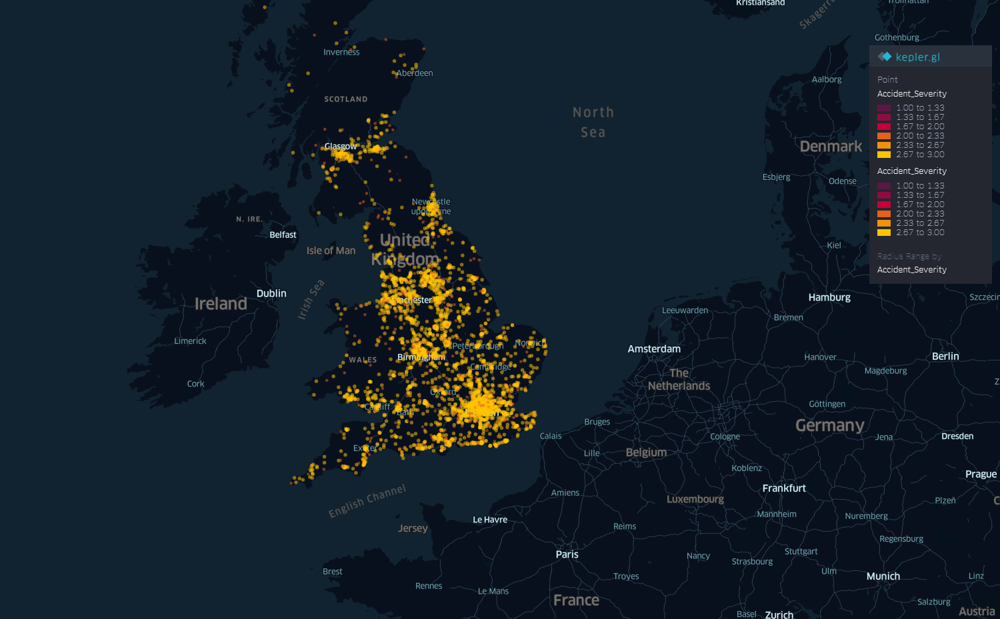

# Map Visualization

### *of UK road accident geospatial data in 2016 using kepler.gl*

#### Interactive map is available at: https://accident.shangjielyu.com/

---

### Data Sources

[1] [Road Safety Data](https://www.data.gov.uk/dataset/cb7ae6f0-4be6-4935-9277-47e5ce24a11f/road-safety-data) by Department for Transport (DfT) (*[Open Government Licence](https://www.nationalarchives.gov.uk/doc/open-government-licence/version/3/)*)
